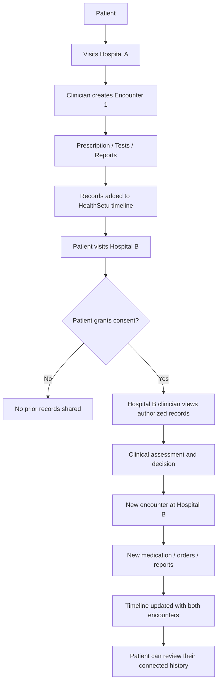
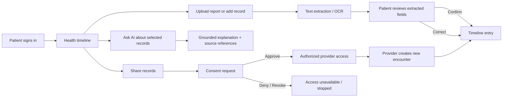
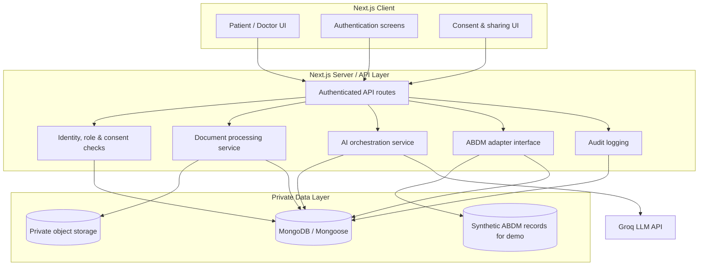
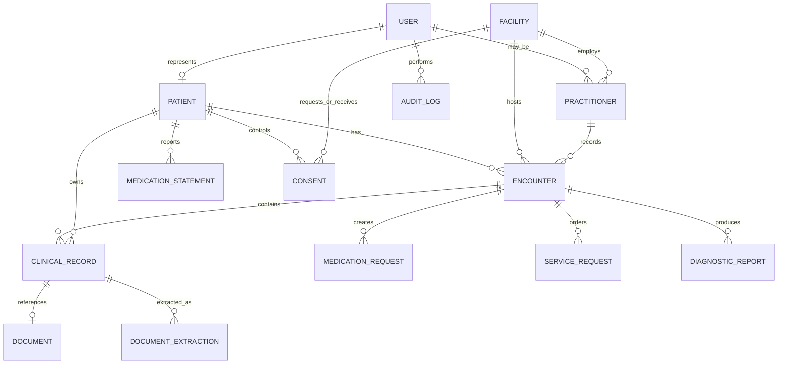

::: {align="center"}
# 🩺 HealthSetu

### A patient-centric, consent-driven longitudinal health record & care-continuity platform

**One patient. Multiple hospitals. A connected health journey.**


:::

---------------------------------------------------------------------

---

## 🌱 Overview

HealthSetu is a patient-centric platform designed to make a person's
medical history easier to carry across healthcare providers. It brings
reports, prescriptions, investigations, and clinical encounters into a
**single chronological health timeline**, so that---when the patient
authorizes access---a clinician at a new facility can review relevant
prior records before making a new clinical decision.

Today, a patient's health information can be scattered across paper
prescriptions, PDFs, diagnostic centres, and separate hospital systems.
When a patient visits another hospital, important context may not be
immediately available. HealthSetu explores how consent-based record
sharing and a longitudinal timeline can support **continuity of care**,
reduce avoidable repetition where clinically appropriate, and help
patients better understand their own records.

> **Core principle:** HealthSetu supports clinical decisions; it does
> not replace the patient--doctor relationship or make autonomous
> diagnoses or prescriptions.

## 🎯 Problem Statement

-   Medical records are often fragmented across hospitals, clinics,
    labs, and personal devices.
-   Patients may not remember the names, doses, or dates of earlier
    medicines and tests.
-   A new doctor may lack the previous clinical context when the patient
    changes facilities.
-   Reports are frequently shared as scans or PDFs, making them
    difficult to search and compare.
-   Patients need a clear way to review what is stored and control what
    is shared.

## 💡 Proposed Solution

HealthSetu aims to provide:

1.  **Unified health timeline** --- encounters, prescriptions, lab
    results, imaging reports, discharge summaries, and patient-uploaded
    documents in date order.
2.  **Patient-controlled sharing** --- a consent flow for sharing
    selected records with a requesting healthcare provider.
3.  **Document understanding** --- text extraction/OCR to help structure
    uploaded reports while retaining the original document and asking
    the user to verify extracted details.
4.  **AI-assisted explanations** --- plain-language summaries and
    questions a patient may want to discuss with a clinician, grounded
    in selected records.
5.  **Care continuity across facilities** --- a Hospital B clinician can
    review authorized Hospital A records and add a new encounter, which
    becomes part of the patient's timeline.
6.  **ABDM-inspired demonstration** --- a clearly labelled simulated
    consent-and-retrieval flow for the hackathon, with synthetic data
    rather than a claim of live government-system access.

## 🏥 Primary Use Case: Hospital A → Hospital B

A patient visits Hospital A for a health concern. The clinician records
an encounter, prescribes medication, and may request a scan or
laboratory test. Later, the patient is still concerned or does not feel
relieved and chooses to visit Hospital B.

With the patient's explicit authorization, the Hospital B clinician can
review the relevant prior records---such as the prescription, scan
report, and earlier clinical notes---then assess the patient and decide
what should happen next. If a new investigation or treatment is
clinically appropriate, Hospital B records it as a new encounter. The
patient's longitudinal timeline is updated rather than replacing the
earlier history.



### What this workflow does---and does not---mean

-   Prior reports can inform a clinician, but **the platform must not
    automatically block a repeat scan or test**. Symptoms, clinical
    changes, image quality, scan coverage, elapsed time, and medical
    judgement may make a repeat investigation appropriate.
-   A medication listed as prescribed is not proof that the patient took
    it. The product should distinguish prescribed medication from
    patient-reported use where possible.
-   A radiology **report** is not the same as the original CT/MRI image
    set. Original imaging may be stored in DICOM or another imaging
    system and is a separate integration concern.
-   Records should retain their source, facility, author, encounter, and
    relevant clinical date to preserve context and provenance.

## 🧭 Product Workflow



## 🧩 Main Features

### 1. Patient Profile & Identity Linkage

-   Internal patient identifier for reliable application-level
    relationships.
-   Patient Unique Health ID (`HS-PT-XXXXXX`) serves as the physician-friendly
    access identifier for care continuity.
-   Identity verification and record authorization are separate
    concerns.

### 2. Medical Document Upload

-   Upload PDF and image formats such as prescriptions, lab reports,
    X-ray reports, CT/MRI written reports, and discharge summaries.
-   Capture clinical date, document type, facility, and optional
    clinician/encounter details.
-   Place the record on the timeline by its **clinical/examination
    date**, not merely its upload date.
-   Preserve the original file and record upload metadata.
-   Keep files private; use controlled access rather than public object
    URLs.

### 3. Report Extraction & OCR

-   Extract text from text-based PDFs.
-   Use OCR for scanned PDFs and images.
-   Structure fields such as report type, examination date, facility,
    findings, impression, and relevant measurements when present.
-   Show extracted values for review and correction before treating them
    as confirmed data.
-   Preserve uncertainty and missing fields; never invent findings or
    silently turn uncertain extraction into clinical fact.

### 4. Unified Longitudinal Timeline

-   Display records chronologically across facilities and record types.
-   Include encounter date, source facility, clinician where available,
    record type, and provenance.
-   Filter by date, facility, category, or encounter.
-   Allow users to open the original document when authorized.
-   Keep historical records immutable in spirit: corrections should be
    traceable rather than erasing provenance.

### 5. AI Health Record Assistant

-   Explain medical terms and summarize selected reports in accessible
    language.
-   Help prepare questions for a doctor and compare the wording of
    records over time.
-   Ground answers in the selected, authorized records and indicate
    which records were used.
-   Avoid diagnosis, prescribing, medication changes, or emergency
    triage as autonomous decisions.
-   Present uncertainty and encourage clinician review, especially when
    records conflict or are incomplete.

### 6. Consent-Based Sharing

-   Patient can review a request, approve or deny it, and revoke access
    where the implemented consent model supports revocation.
-   Access should be limited to the purpose, records, recipient, and
    time period shown in the consent request.
-   Record consent events and provider access in an audit trail.
-   Never treat possession of an identifier as automatic permission to view a
    patient's records without active consent.

### 7. Hospital & Clinician Workspace

-   Separate facility and practitioner accounts/roles.
-   A clinician sees only patients and records for which their role and
    authorization permit access.
-   Hospital B can review consented prior records, document a new
    encounter, and add new prescriptions, service requests, and reports.
-   New entries retain their facility and practitioner provenance.

### 8. ABDM-Inspired Demo Mode

-   Use synthetic patient identities and synthetic clinical records.
-   Demonstrate consent grant, denial, and revocation states, plus
    retrieval of mock records.
-   Display a persistent **"Demo Mode --- Synthetic Data"** label
    wherever simulated ABDM behavior appears.
-   Do not describe the prototype as connected to live ABDM
    infrastructure unless a real, approved integration has been
    completed and tested.

## 🏗️ High-Level Architecture



### Suggested Technology Stack

  -----------------------------------------------------------------------
  Layer                   Technology              Responsibility
  ----------------------- ----------------------- -----------------------
  Frontend                Next.js App Router,     Patient and clinician
                          React, TypeScript       experiences

  Styling                 Tailwind CSS            Responsive UI and
                                                  design system

  Backend                 Next.js Route Handlers  Authentication,
                          / server-side services  authorization, APIs,
                                                  orchestration

  Database                MongoDB Atlas +         Users, encounters,
                          Mongoose                records, consent, audit
                                                  metadata

  File storage            Private object storage  Original PDFs/images;
                          (e.g., S3)              store object keys in
                                                  MongoDB

  AI                      Groq API (server-side)  Record-grounded
                                                  explanations and
                                                  summaries

  Extraction              PDF text extraction +   Convert documents into
                          OCR service             reviewable structured
                                                  fields

  ABDM demo               Mock adapter +          Demonstrate consent and
                          synthetic data          record exchange
                                                  workflow

  Deployment              Vercel for web;         Hosting, subject to
                          suitable secured        production security
                          service for processing  review
  -----------------------------------------------------------------------

> A CDN such as CloudFront is a delivery layer, not the primary record
> database. Keep medical files in private storage and provide access
> only through short-lived, authorized links or an equivalent controlled
> mechanism. Never expose storage secrets in client-side code.

## 🗃️ Suggested Data Model

The following is a conceptual starting point, not a finalized clinical
interoperability schema. Use stable internal IDs and explicit references
between entities.



### Suggested Collections

  -----------------------------------------------------------------------
  Collection                          Purpose / example fields
  ----------------------------------- -----------------------------------
  `users`                             Authentication identity, account
                                      status, role assignments

  `patients`                          Internal patient UUID, profile,
                                      separately protected identity
                                      linkages

  `facilities`                        Facility profile and integration
                                      status

  `practitioners`                     Practitioner identity, facility
                                      relationship, verified role
                                      metadata

  `encounters`                        Patient, facility, practitioner,
                                      encounter date, reason, summary,
                                      status

  `clinicalRecords`                   Patient, encounter, category,
                                      clinical date, source, document
                                      reference

  `documents`                         Private object key, MIME type,
                                      checksum, upload metadata, access
                                      metadata

  `documentExtractions`               Extracted fields, method,
                                      confidence/uncertainty, review
                                      state, reviewer

  `medicationRequests`                Medication prescribed,
                                      dose/instructions, author, date,
                                      encounter

  `medicationStatements`              Patient-reported medication use and
                                      status, kept distinct from
                                      prescriptions

  `serviceRequests`                   Ordered tests, imaging, referrals,
                                      and their status

  `diagnosticReports`                 Report content/summary, report
                                      date, result references

  `consents`                          Requester, purpose, scope, status,
                                      timestamps, expiry/revocation data

  `auditLogs`                         Actor, action, patient/record
                                      reference, time, outcome, request
                                      context

  `assistantConversations`            Minimal assistant interaction
  *(optional)*                        metadata and references to records
                                      used
  -----------------------------------------------------------------------

**Data modelling notes:** - Use an internal patient UUID as the primary
application identifier and `patientUniqueId` (`HS-PT-XXXXXX`) as the human-friendly
record access identifier. - Store clinical date and upload/created date
separately. - Keep source facility, practitioner, encounter, and
document provenance attached to records. - Model consent as an explicit
authorization object, not a boolean on the patient profile. - Avoid
storing unnecessary extracted clinical text in logs or analytics.

## 🔐 Privacy, Security & Trust

Health records are sensitive. A hackathon demo should still demonstrate
privacy-by-design:

-   **Authentication:** secure sessions and appropriately protected
    credentials.
-   **Authorization:** enforce role, patient relationship, consent
    scope, and purpose on the server for every protected request.
-   **Least privilege:** expose only the minimum record fields needed
    for the current task.
-   **Private storage:** no public buckets or permanent public links for
    medical documents.
-   **Consent lifecycle:** show what is requested, by whom, why, for
    which records, and for how long; support deny/revoke behavior in the
    demo.
-   **Auditability:** log access and changes with actor, time, action,
    and outcome; avoid sensitive payloads in logs.
-   **Data protection:** encrypt data in transit and at rest, manage
    secrets server-side, validate uploads, and apply file-size/type
    limits.
-   **AI safeguards:** send only selected authorized content to the
    model; avoid unnecessary identifiers; show record sources and
    uncertainty.
-   **Synthetic demo data:** never use real patient data in public demos
    without the required approvals, safeguards, and lawful basis.
-   **Retention and deletion:** define policies before production use,
    including document lifecycle and account closure.

## 🇮🇳 ABDM Context & Integration Boundary

HealthSetu's proposed direction is compatible with the broad idea of
patient-controlled, consent-based health-information exchange, but the
hackathon version should be honest about its integration level.

-   Possession of a patient identifier is **not by itself an
    access token or blanket permission** to retrieve a patient's
    complete history.
-   In the ABDM model, records are generally held by originating
    providers and shared through applicable consent-based exchange flows
    rather than being treated as one unrestricted central database.
-   Live integration requires the appropriate ABDM onboarding, roles,
    technical specifications, security controls, and approvals for the
    participating entities and use case.
-   The demo therefore uses a mock adapter and synthetic records. Keep
    the adapter boundary separate so a properly authorized integration
    can be explored later without rewriting the entire product.
-   Availability of records depends on provider participation, linkage,
    and the applicable exchange workflow; HealthSetu cannot promise that
    every hospital record will be discoverable.

**Important:** This README describes a prototype concept, not legal
advice, a certification, or confirmation of live ABDM connectivity.
Before handling real patient data, obtain qualified legal, clinical,
security, and ABDM integration guidance and complete the applicable
reviews.

## 🧪 Demo Scenario

A clear judging/demo walkthrough can use two synthetic facilities and
one synthetic patient:

1.  Sign in as a demo patient and open the health timeline.
2.  Show a Hospital A encounter with a synthetic prescription and
    diagnostic report.
3.  Sign in as a Hospital B clinician and search/select the synthetic
    patient using the demo identity flow.
4.  Submit a request to access selected prior records, including purpose
    and scope.
5.  Return to the patient view and approve or deny the request.
6.  Show that Hospital B can access only the authorized records after
    approval.
7.  Create a new Hospital B encounter, add a new order or medication
    request, and attach a new report.
8.  Return to the patient timeline and show both hospitals' records in
    chronological order, with source and encounter details.
9.  Revoke demo access and show that subsequent access is denied, while
    the audit trail records the event.
10. Ask the AI assistant to summarize a selected report and show the
    source record(s) used.

All records in this walkthrough should be synthetic and clearly
labelled.

## 🖼️ Screenshots & Visual Assets

Add real product screenshots here as the UI is implemented. Keep all
screenshots synthetic---no actual patient names, personal identifiers, or
medical documents.

  ---------------------------------------------------------------------------------------------------------------------------------------------------------------------------------
  Patient timeline                                          Consent request                                         Clinician encounter
  --------------------------------------------------------- ------------------------------------------------------- ---------------------------------------------------------------
  ``   ``   ``

  ---------------------------------------------------------------------------------------------------------------------------------------------------------------------------------

Suggested visual assets to create: - `docs/images/patient-timeline.png`
--- chronological records with date, category, and source facility. -
`docs/images/consent-request.png` --- recipient, purpose, requested
scope, duration, approve/deny controls. -
`docs/images/clinician-encounter.png` --- prior authorized records
beside the new encounter form. - `docs/images/document-review.png` ---
OCR-extracted fields awaiting patient verification.

The Mermaid diagrams above provide renderable diagrams directly in
GitHub and compatible Markdown viewers. Replace the screenshot paths
with actual assets once captured; do not commit real patient data.

## 🛠️ Getting Started

> This section is a suggested setup outline. Adjust commands and
> environment variables to match the implementation as it evolves.

### Prerequisites

-   Node.js LTS
-   npm, pnpm, or another chosen package manager
-   MongoDB Atlas cluster or local MongoDB instance
-   Groq API key for server-side AI features
-   Private object storage configuration if document uploads are enabled

### Installation

``` bash
# Clone the repository
 git clone <your-repository-url>
 cd healthsetu

# Install dependencies (use the package manager matching your lockfile)
 npm install

# Start the development server
 npm run dev
```

Open `http://localhost:8000` in your browser.

### Environment Variables

Create a local `.env.local` file. Names below are examples; align them
with the actual codebase.

``` dotenv
MONGODB_URI=
AUTH_SECRET=
GROQ_API_KEY=
# Optional private object storage configuration
AWS_REGION=
AWS_S3_BUCKET=
AWS_ACCESS_KEY_ID=
AWS_SECRET_ACCESS_KEY=
# Optional demo toggle
HEALTHSETU_DEMO_MODE=true
```

Never commit `.env.local`, secrets, private keys, real patient identifiers,
or real patient documents. Keep AI and storage credentials on the server
only.

## 🗺️ Development Roadmap

-   [ ] **Foundation:** Next.js + TypeScript setup, responsive design
    system, environment validation.
-   [ ] **Identity & roles:** authentication,
    patient/practitioner/facility models, server-side authorization.
-   [ ] **Encounters & records:** create encounters and attach
    structured clinical records with provenance.
-   [ ] **Document vault:** private upload, file validation, secure
    access, metadata capture.
-   [ ] **Extraction review:** PDF text extraction/OCR, structured
    fields, confidence/uncertainty, human confirmation.
-   [ ] **Timeline:** unified chronological view, filtering, record
    detail, original document access.
-   [ ] **Consent:** request, approve, deny, expiry, revoke, and audit
    behavior.
-   [ ] **Hospital A/B demo:** authorized review of previous records and
    creation of new encounters.
-   [ ] **AI assistant:** selected-record grounding, citations/source
    links, safety boundaries, server-side key handling.
-   [ ] **ABDM mock adapter:** synthetic records, clearly labelled demo
    flow, adapter interface.
-   [ ] **Quality & security:** unit/integration tests, access-control
    tests, upload tests, threat review, accessibility checks.
-   [ ] **Deployment:** secure configuration, monitoring, backups,
    retention policy, and production-readiness review.

## 🧱 Design Principles

-   **Patient agency:** the patient can inspect records and control
    sharing within the supported consent model.
-   **Continuity, not replacement:** each facility contributes a new,
    attributable event to the history.
-   **Clinical context matters:** show dates, source, and encounter
    context---not just extracted text.
-   **Human verification:** OCR and AI outputs are assistive and
    reviewable.
-   **Privacy by default:** access is narrow, purpose-bound, auditable,
    and revocable where supported.
-   **Interoperability-ready, not falsely interoperable:** simulate
    external exchange until a real approved connection exists.
-   **No automated clinical authority:** doctors remain responsible for
    clinical decisions.

## 🚧 Current Scope & Limitations

-   The hackathon prototype demonstrates the workflow with synthetic
    data and a simulated ABDM-style exchange.
-   Real ABDM connectivity, provider onboarding, production-grade
    identity verification, and regulatory/security approvals are
    separate future work.
-   OCR quality varies by scan quality, language, layout, and
    handwriting; extracted data needs review.
-   AI summaries can omit or misinterpret information and must not be
    treated as a diagnosis or prescription.
-   A prior report may be unavailable, incomplete, outdated, or
    clinically insufficient for a new decision.
-   A record timeline does not guarantee a complete medical history.

## 🤝 Contributing

Contributions, issue reports, and ideas are welcome. For clinical-data
features, include privacy, provenance, consent, and safety
considerations in the design and tests. Avoid submitting real patient
information in issues, pull requests, screenshots, or sample fixtures.

## 📄 Disclaimer

HealthSetu is a software prototype intended to explore
patient-controlled health-record continuity. It is not a medical device
or substitute for professional medical advice, diagnosis, or treatment.
In an emergency, contact local emergency services or seek urgent
in-person medical care. Do not use the demo with real patient data.

------------------------------------------------------------------------

::: {align="center"}
**HealthSetu --- Connecting records to support continuity of care.**

Built as a hackathon prototype. *Demo Mode uses synthetic data.*
:::
